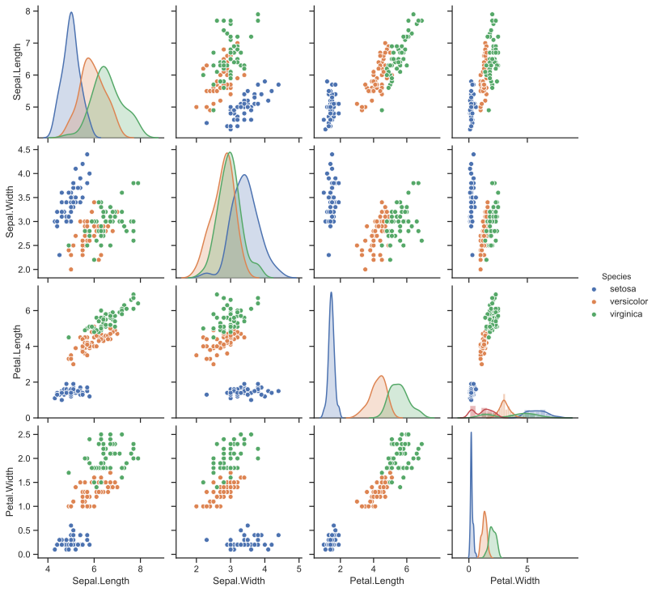

# Task 1 &mdash; the iris dataset

`This report shows my line of thought. To present my workflow better, I have attached excerpts of the source code.`

**Goal: classification of iris flowers** 

## Cleaning data 

Data is the foundation of machine learning. Therefore it is a good place to start. First of all, we have to load it into Python. We know it should contain only 150 rows of data, so we can open the dataset in a text editor and review it manually. There we find a bit uncommon delimiter and a troublesome negative value in one of the columns, that is highly improbable (lengths are more often than not positive in value). When we are familiar with the structure of the file, we can load it up:

```Python
import pandas as pd
df = pd.read_csv('Graduate - IRISES dataset (2019-06).csv', sep='|')
```

Now it is time for a more refined quality check. In order to find all troublemakers, we should check for consistency of types, class balance and do a NaN search. There are 3 problems I can see: 

1) that negative value,
2) missing value in an another column,
3) coma instead of a period in one entry (petal.width should be float type, not object).

```Python
print(df.info)
print(df.describe())
print(df.groupby('Species').count())
print(df.isna().sum())

# new line and empty string added to prettify output, without them it is misaligned 
# Lines below shows us problematic rows in the dataset
print('\n',df[df['Sepal.Length'] < 0])
print('', df[df['Sepal.Width'].isna()])
```

Let us start with the third problem:
```Python
df['Petal.Width'] = df['Petal.Width'].replace(',','.', regex=True).astype(float)
```


And done! Now back to the other two. There are many approaches to dealing with missing or wrong data. Most popular are:
1) simply deleting rows of data containing such (non-)values,
2) interpolation/filling with values

That negative value looks like a human mistake (sabotage?) and in my assessment its absolute value fits the rest of the column. One is manageable, but should there be more such mistakes, we should ask the client to check the data and send a corrected dataset. In this case, we can simply remove the minus sign ('-').

If it comes to the missing value, we can try to fill it, based on statistical properties of the column. Simple statistical test (Shapiro-Wilk) shows that the data in most cases does not follow normal distribution, therefore there is a high chance median value represents general values in the column better than mean value. However, calculating such value before splitting the data for training and test subsets leads to overfitting (small in this case, but still), due to it being a piece of knowledge transcending the test subset and having insight into the whole dataset. Which is a thing we should strive to avoid, while testing validity of machine learning models. Let us leave this value for now &mdash; we shall deal with it later, after splitting the dataset.

## Visualizing data

After cleaning the data, it is very useful to visualize it. Plots are an easy way to find clusters of data, outliers, and are very helpful in case we have to choose a kernel for some machine learning algorithms (e.g. linear vs quadratic for SVM). 

```Python
import seaborn as sns
sns.set(style="ticks")
sns.pairplot(df, hue="Species")
```



In this case, we can easily see one distinct cluster (containing only Setosa specie) and one mixed. We can also clearly see that some features and their interactions discriminate Virginica and Versicolor better than others. Should we have problems in the learning phase, we will be able to manually or algorithmically reduce the number of features to the ones providing the most variance between classes.

## Classification

### Cross-validation 
In most cases static split of data is a waste of a valuable resource. So, in order to check the validity of the model, we should use cross-validation techniques. Once again, there are many options, I often use stratified cross-validation which takes care of even class representation when splitting data. 

If it comes to classifiers, SVM and LDA are very common choices and I have decided to start with them, with default parameters.

```Python
sk = StratifiedKFold(n_splits=5, shuffle=True)
svc = SVC()
lda = LDA()
classifier = lda
X = np.array(df.drop('Species', axis=1))
Y = np.array(df['Species'])
for train, test in sk.split(X, Y):
    classifier.fit(X[train], Y[train])
    predicted = classifier.predict(X[test])
```

### Measures and results
To my surprise, results are more than satisfactory. With the most basic configuration both classifiers achieve accuracy up to 98%, though LDA seems to be more consistent with that. 

#### Results for LDA
    Accuracy: 98.00% (+/- 2.67%)\
    F1 score: 98.00% (+/- 2.67%)

Summed Confusion Matrix:
|true\predicted | Setosa | Versicolor | Virginica |
|------------|--------|------------|-----------|
| Setosa     |   50   |      0     |     0     |
| Versicolor |    0   |     49     |     2     |
| Virginica  |    0   |      0     |     49    |

Number of instances:  150

#### Results for SVM
    Accuracy: 97.33% (+/- 3.27%)\
    F1 score: 97.32% (+/- 3.28%)

Summed Confusion Matrix:
|true\predicted | Setosa | Versicolor | Virginica |
|------------|--------|------------|-----------|
| Setosa     |   50   |      0     |     0     |
| Versicolor |    0   |     47     |     3     |
| Virginica  |    0   |      1     |     49    |
Number of instances:  150

## Discussion
As always, there is room for improvements. For instance, a grid search could be ordered to find perhaps more optimized parameters. There is also no feature reduction. However, results are still satisfactory and one should not be too focused on accuracy, because at some point it might come at cost of external validity of the model.